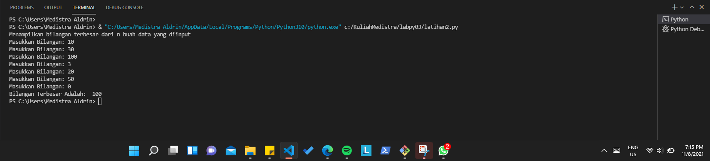

# labpy03 (Algoritma/ Penjelasan)

# Modul_Praktikum_2
## latihan1
### Program menentukann nilai akhir

#### penjelasan alur program
Masukan program untuk menentukann nilai akhir

1. print("Program menentukan nilai akhir") - adalah perintah untuk menampilkan judulnya.

2. nama = input("Masukan nama:") - adalah perintah untuk menginput nama

3. uts = input("Masukan nilai UTS:") - adalah perintah untuk menginput nilai  UTS

4. uas = input("Masukan nilai UAS:") -  adalah perintah untuk menginput nilai UAS

5. tugas = input("Masukan nilai tugas:") - adalah perintah unntuk menginput nilai tugas

6. akhir = (int(tugas) * .2) + (int(uts) * .4) + (int(uas) * .4) - adalah perintah untuk menghitung nilai akhir

7. keterangan = ("TIDAK LULUS","LULUS")[akhir> 60.0] - adalah perintah untuk mengeluarkan pernyataan lulus atau tidak lulus

8. if akhir > 80: - adalah perintah untuk tipe data if atau jika, 80 adalah input nilai minimal untuk integer

9. huruf = "A" - adalah program untuk menampilkan huruf "A" jika nilai yang dimasukan lebih dari 80

10. elif akhir > 70: - adalah perintah untuk tipe data elif atau alternatif, 70 adalah input niai minimal untuk integer 

11. huruf = "B" - adalah program untuk menampilkan huruf "B" jika nilai yang dimasukan lebih dari 70 dan kurang dari 80

11. elif akhir > 50: - adalah perintah untuk tipe data elif atau  alternatif, 50 adalah input nilai minimal untuk integer

12. huruf = "C" - adalah proogram unntuk menampilkan huruf "C" jika nilai yang di masukan lebih dari 50 dan kurang dari 70

13. elif akhir > 40: - addalah perintah untuk tipe data elif atau alternatif, 40 adalah input nilai minimal untuk integer

14. huruf = "D" - adalah program untuk menampilkan huruf "D" jika nilai yang di masukan lebih dari 40 dan kurang dari 50

15. else: - adalah perintah untuk tipe data else atau lain

16. huruf = "E" - adalah program unntuk menampilkann huruf "E" jika nilai yang di masukan kurang dari 40

17. print("\nNama       :",nama) - adalah perintah unntukk menampilkan nama yang telah di input

18. print("Nilai UTS    :",uts) - adalah perintah untuk menampilkan nilai UTS yang telah di input

19. print("Nilai UAS    :",uas) - adalah perintah untuk menampilkam nilai UAS yang telah di input

20. print("Nilai Tugas  :",tugas) - adalah perintahh untuk menampilkan nilai tugas yang telah di input

21. print("Nilai Akhir  :",akhir) - adalah perintah untuk menampilkan nilai akhir sesuai perhitungan yang telah dibuat

22. print("\nNilai Huruf    :",huruf) - adalah perintah untuk menampilkan huruf sesuai dengan nilai akhir yang keluar

23. print("Keterangan   :",keterangan) - adalah perintah untuk menampilkan keterangan LULUS atau TIDAK LULUS

#### Berikut contoh gambar programnya

setelah membuat program, kemudian "RUNN" program dan masukan nama, nilai UTS, nilai UAS, dan nilai tugas. lalu program akan menampilkan hasil nilai akhir, huruf sesuai nilai akhir, dan keterangan LULUS atau TIDAK LULUS.

#### Berikut contoh hassil dari program saat dijalankan

SELESAI

## latihan2
### Program untuk menampilkan status gaji karyawan

#### penjelasan alur program:
Masukan program untuk menampilkan status gaji karyawan seperti berikut

1. print("Program menampilkan status gaji karyawan") - adalah perintah untuk menampilkann judulnnya

2. gaji = int(input("Masukann gaji:")) - adalah perintah untuk menginput gaji

3. berkeluarga = (False, True)[input("Sudah berkeluarga? (Y/T)") == "Y"] - adalah program untuk menentukan status berkeluarga dengan ketentuan False, True dan menampilkan pertanyaan "sudah berkeluarga?" lalu dinyatakan dengan pilihan Y/T

4. punya_rumah = (False, True)[input("Punya rumah? (Y/T)") == "Y"] - adalah program untuk menentukan status punya_rumah dengan ketentuan False, True dan menampilkan pertanyaan "punya rumah?" lalu dinyatakan dengan piliham Y/T

5. if gaji > 3000000: - adalah perintah untuk tipe data if atau jika gaji diatas 3000000

6.     print ("Gaji sudah diatass UMR") - adalah perintah untuk menampilkan hasil jika gaji yang diinput lebih dari 3000000

7.     if berkeluarga: - adalah perintah untuk tipe data if atau jika sudah berkeluarga

8.      print ("- Wajib ikutan asuransi dan menabung untuk pensiun") - adalah perintah untuk menampilkan hasil jika sudah berkeluarga

9.     else: - adalah perintah unntuk tipe data else atau lain

10.         print ("- Tidak perlu ikutan asuransi") -adalah perintah untuk menampilkan hasil jika belum berkeluarga atau hasil lain yang diinput

11.     if punya_rumah: - adalah perintah untuk tipe data if atau jika sudah punya rummah

12.         print ("- Wajib bayar pajakk rummah") - adalah perintah untuk menampilkan hasil jika sudah punya rumah

13.     else: - adalah perintah untuk tipe data else atau lain

14.         print ("- Tidak wajib bayar pajak rumah") - adalah perintah untuk menampilkan hasil jika belum punya rumah atau hasil lain yang diinput

15. else: - adalah perintah untuk tipe data else atau lain

16.     print ("gaji belum UMR") - adalah perintah untuk menampilkan hasil langsung jika gaji yang diinput dibawah 3000000

#### Berikut contoh programnya

# Modul_Praktikum_3
## latihan1
### Program untuk menampilkan n bilangan acak yanng lebih kecil dari 0.5

#### penjelasan alur program:
Masukan program untuk menampilkan bilangan acak yanng lebiih kecil dari 0.5 seperti berikut

1. print("Tampilkan n bilangan acak yang lebih kecil dari 0.5") - adalah perintah untuk menampilkan judulnya.

2. jumlah = int(input("Masukkan jumlah n: ")) - adalah perintah untuk menginput nilai n tersebut

3. import random - adalah perintah untuk mengimport built-in random yang telah tersedia di python

4. for i in range(jumlah): - adalah perintah untuk i sebagai integer dalam baris jumlah

5.    print("data ke", i+1,"=",(random.uniform(0.1,0.5))) - adalah perintah untuk menampilkan hasil yang telah di input dengan ketentuan random uniform mulai dari nilai 0.1 sampai 0.5

#### Berikut contoh gambar programnya:

setelah membuat program, kemudian "RUN" program dan masukan nilai N (Berapa banyak  data yg di  inginkan). lalu program akan menampilkan hasil data bilangan acak yanng lebih  kecil dari 0.5 sebanyak yang anda inginkan.

#### Berikut contoh hasil dari prrogram saat dijalankan:

SELESAI

## latihan2
### program untuk menampilkan bilangan terbesar dari n buah data yang diinputkan

#### Penjelasan alur program:
Masukan program untuk menampilkan bilangann terbesar dari sebuah data yang di input seperti berikut

1. print("Menampilkan bilangan terbesar dari n buah data yang diinput") - adalah perintah untuk menampilkan judul program

2. max = 0 - adalah perintah untuk menampilkan nilai max yang adalah 0

3. while True: - adalah perintah untuk pengulangan hingga waktu yang tidak ditentukan

4.      a = int(input("Masukkan Bilangan: ")) - adalah perintah untuk menginput nilai integer

5.   if max < a: - adalah perintah untuk tipe data if atau jika, maksimal nilai lebih kecil dari a atau integer

6.      max = a - perintah untuk nilai maximal sama dengan a atau integer

7.    if a ==0: - perintah untuk tipe data if atau jika a sama dengan 0 maka

8.      break - perintah untuk mengakhiri pengulangan, jadi jika menginput nilai 0 maka pengulangan berakhir atau selesai

9. print("Bilangan Terbesar Adalah: ", max) - adalah perintah untuk menampilkan hasil bilangan yang terbesar dari angka-angka yang telah terinput

#### Berikut contoh gambar programnya:

Setelah membuat program, kemudian "RUN" program dan masukan  nilai yang di  inginkan satu persatu. Data akan langsung terhenti dan akan menampilkan hasil jika telah menginput nilai 0 (nol).

#### Berikut contoh dari hasil program setelah dijalankan:

SELESAI

## Program1
### Program untuk meenghitung laba investasi

#### Penjelasan alur program:
Masukan program untuk menghitung laba investasi seperti berikut

print("Laba Investasi") - adalah untuk menampilkan judul

x = int(input("Uang Modal Awal: ")) - adalah untuk menginput nilai x sebagai modal awal

a = 0*x - a adalah bulan pertama, karena bulan pertama belum memiliki laba, jadi masih 0 dikali dengan x nilai uang modal awal

b = 0*x - b adalah bulan kedua, karena bulan kedua belum memiliki laba, jadi nilai x dari uang modal dikali dengan 0

c = 0.01*x - c adalah bulan ketiga, dan sudah memiliki laba 1%, jadi ditulis 0.01 bentuk sederhana dari 1% dikali dengan modal atau uang awal dengan nilai x

d = 0.01*x - d adalah bulan keempat, dan labanya 1%, jadi ditulis 0.01 dikalikan dengan nilai x yang adalah uang awal atau modal

e = 0.05*x - e adalah bulan kelima, dan laba pada bulan kelima sebesar 5%, maka ditulis 0.05 dikalikan dengan nilai x untuk nilai uang awal atau modal

f = 0.05*x - f adalah bulan keenam, dan laba pada bulan keenam sebesar 5%, maka ditulis 0.05 dikalikan dengan nilai x untuk nilai uang awal atau modal

g = 0.05*x - g adalah bulan ketujuh, dan laba pada bulan ketujuh sebesar 5%, maka ditulis 0.05 dikalikan dengan nilai x untuk nilai uang awal atau modal

h = 0.02*x - h adalah bulan kedelapan, dan laba pada bulan kedelapan sebesar 2%, maka ditulis 0.02 dikalikan dengan nilai x untuk nilai uang awal atau modal

y=[a,b,c,d,e,f,g,h] - adalah untuk menentukan syarat y yang berisi a,b,c,d,e,f,g,h

for i in range(len(y)): - adalah untuk perulangan data dengan isi data y, dengan menampilkan urutan laba perbulan sesuai range yang di tentukan dengan hasil ke urutan yang diinputkan dari data y

    print("Laba Bulan Ke",i+1 ,"sebesar: ",y[i]) - untuk menampilkan hasil laba dari bulan ke 1 sampai terakhir

z=(a+b+c+d+e+f+g+h) - Z untuk data yang berisi hasil penjumlahan laba dari bulan pertama sampai bulan ke delapan

print("Jumlah Laba Selama 8 Bulan: ",z) - menampilkan hasil dari jumlah laba

#### Berikut contoh gambar perogramnya:

Setelah membuat program, kemudian "RUN" program dan masukan  jumlah uang modal awal yanng telah di tentukan. setelah memasukan jumlah uang modal maka data akan menghitung hasil persentasi sesuai dengan program.

#### Berikut contoh hasil dari program setelah di jalankan:

